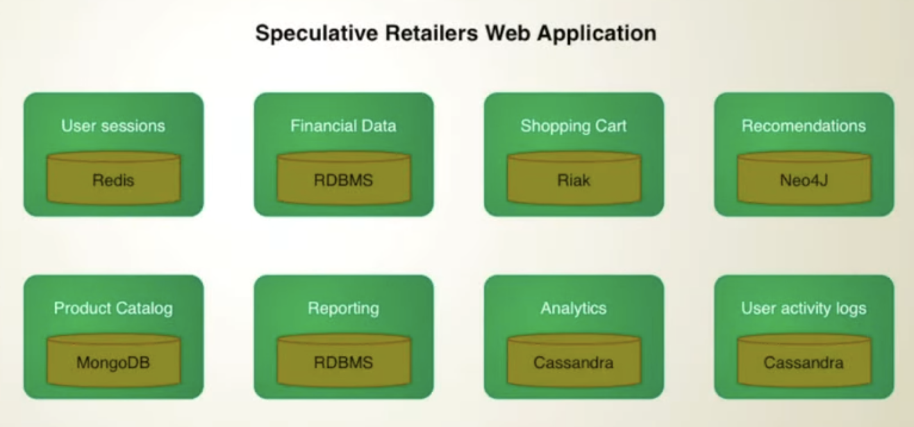

# Databases

Why would you use a database over a spreadsheet?
Data integrity, records, relations bewteen tables, more storage, data consistency

Picking the right database for a system is an important decision, as it can have a significant impact on the performance, scalability, and overall success of the system. Some of the key reasons why it's important to pick the right database include:

- Performance: Different databases have different performance characteristics, and choosing the wrong one can lead to poor performance and slow response times.

- Scalability: As the system grows and the volume of data increases, the database needs to be able to scale accordingly. Some databases are better suited for handling large amounts of data than others.

- Data Modeling: Different databases have different data modeling capabilities and choosing the right one can help to keep the data consistent and organized.

- Data Integrity: Different databases have different capabilities for maintaining data integrity, such as enforcing constraints, and can have different levels of data security.

-  Support and maintenance: Some databases have more active communities and better documentation, making it easier to find help and resources.

## ACID vs BASE

Need to make sure that data is consistent when many people are making updates to the data. Only get to write half the data and somebody else reads it or you get to write and somebody overwrites it. Need a mechanism to control to give atomic updates - transactions -  to suceed or fail and nobody messes things up. This is a consistency aim. 

Graph databases are ACID. 

Keep transactions within a single aggregate. Aggregate oriented databases are naturally ACID. Only when updating multiple documents do you have to worry about ACID transactions

Cant afford to hold transactions for a user interaction. Avoid collisions in uodates when two users try to update the same data. 

Logical consistencies - updating the same inventory stock
Replication consistencies - having the same data among database partitions

Consistency - not allowing the customers to book a hotel room
Availability - allowing the overbooking. DynamoDB always aims for availability

Heavily depends on the business context - Amazon always wants people to be able to add things into their shopping cart hence DynamoDb being always available.

#### CAP Theorem
When distributing a database, you have a choice. Consistency or Availability. They are actually on a spectrum. 

Consistency vs Response Time (latency) nodes have to communicate between each other to make decisions
Safety vs Liveness

Relaxing durability
Eventual consistency
Quorums
Read your writes consistency

## SQL vs NoSQL

All are schemaless

how do you work with your data? 
aggregates all the time? jump across different structures? tabular?

SQL databases, such as MySQL and PostgreSQL, are best suited for structured, relational data and use a fixed schema. They provide robust ACID (Atomicity, Consistency, Isolation, Durability) transactions and support complex queries and joins.

NoSQL databases, such as MongoDB and Cassandra, are best suited for unstructured, non-relational data and use a flexible schema. They provide high scalability and performance for large amounts of data and are often used in big data and real-time web applications.

The choice between SQL and NoSQL depends on the specific use case and requirements of the project. If you need to store and query structured data with complex relationships, an SQL database is likely a better choice. If you need to store and query large amounts of unstructured data with high scalability and performance, a NoSQL database may be a better choice.

- SQL and NoSQL databases both store data but take different approaches; SQL databases are structured and require a predefined schema, while NoSQL databases are more flexible and can store any data anywhere, which can lead to consistency issues.

- SQL databases use normalization to minimize data redundancy, while NoSQL databases often opt for denormalization, leading to faster queries but slower updates when changing information in multiple records.

- SQL databases offer transaction functionality for multiple updates, ensuring either all updates succeed or fail, while NoSQL databases only offer atomic modifications for single documents and lack a transaction equivalent for multiple documents.

- While NoSQL is often quoted as being faster than SQL due to its simpler denormalized store, the design of the project and data requirements will have the most impact on performance.

- NoSQL’s simpler data models make scaling easier, as many have been built with scaling functionality from the start, while scaling can be tricky for SQL-based systems.

Projects where SQL is ideal:

    logical related discrete data requirements which can be identified up-front
    data integrity is essential
    standards-based proven technology with good developer experience and support.

Projects where NoSQL is ideal:

    unrelated, indeterminate or evolving data requirements
    simpler or looser project objectives, able to start coding immediately
    speed and scalability is imperative.
    Massive amounts of data. More than 1TB in Year 1. 
    Data intensive application
    Super low latency
    Metadata driven data sets
    Highly nonrelational data
    need schemaless data constructs
    rapid ingestion of data (thousands of rows per second)

## Scaling 

When is it necessary?
Slow queries, timeouts and crashes

What is the bottleneck? Answer this before deciding what to scale.

### Horizonal Scaling
Leader-Follower patterns where we start adding read replicas. This allows the Leader to focus solely on writes while followers serve reads.

Sharding - splitting a DB into smaller more manageable pieces that contain a subset of the data. Challenges that come with sharding are resharding after imbalanced shards and querying across multiple shards complexity.

### Vertical scaling 
involves increasing the CPU, RAM or storage of the database to be able to handle queries quickly. Does not resolve redundance - there is a single point of failure

It can be approached by federation - using different databases for specific functions like users, products, etc. - or sharding. Sharding means the data is split among many databases in the same schema. Sharding addsc complexity because you need to build the logic to quickly and efficiently query the data amonf shads but the benfit is you can scale horizontally much easier. 

Another way to scale a database is to move some functionality to a NoSQL database. Use cases include: leaderboards, "hot" tables, metadata/lookup tables, cart data, and rapid ingest of stream or lo data. 

### Normalization vs Denormalization
Denormalization
Reduce complex joins to improve query performance by *storing redundant data*. Social media platforms like Facebook store user data and posts data to minimize the need for complex joins. *Updates must be carefully managed to maintain consistency* in the DB. Faster reads, slower writes, less joins, less but bigger tables.

Normalization
Storing data into a traditional transactional processing system. Normalization has 6 forms 1NF - 5NF & BCNF. Data integrity through ACID. *Faster and heavier writes*. Smaller tables and multiple joins. Reads are lower due to number of joins.

when to choose what?
Normalize: write intensive, data integrity is important, optimize disk usage, consistent transactions, more joi
Denormalize: read intensive, faster reads, data integrity is not important

It's a spectrum, choose what works best for the use case. Balanced approaches

### Views
Take complex sql queries and store them under a name. *Virtual table based on a query* - we can treat them like an actual table. Quickly access frequently used data. Does not use data storage. Slower because its dynamic. Better for real time data.

### Materialized Views
*Stores query results physically*. Precomputed snapshots of data that are stored for faster access. Precompute complex query results and store them for faster reads. Too slow to compute on the fly every time. Instead of hitting the raw data we use the materialized view. Need to be refreshed periodically to avoid stale data which can be compute intensive. For faster performance with static data 

### Heap 
Heap is like a book where you have all your content

### Indexing
Table of contents, back of the book indexing to find the page where the content is in the book, allows to quickly search for where the data is without having to scan every record. They may slow down write performance. You can make multi column indexes for frequently accessed columns reducing data that is needed to scan. 

PosgreSQL locks the table when making an index. Using the CONCURRENTLY option creates the index without locking the table. 

Expression indexes - create index idx_exp on (lower(name)); <- Expression. They can also be used for math calculations

Best Practices:
- Dont create more indexes than you need. They need to be kept updated and too many will slow writing performance
- Try to avoid large indexes. They take up more storage on disk
- Use EXPLAIN to evaluate query performance

#### B Tree Index
default index type in PosgreSQL
B-Tree Indexes keep the data sorted, fast insertion, deletion and searching
uses all operators 
#### GIN Index
Generalized Inverted Index
used when we need to index composite values
Used for searching documents, text search

#### GIST Index
Generalized Search Tree
used for indexing complex data types
intraarray
full text search

#### HASH Index
Only handles equality operators 
used to locate tuples
Advantages within the database:
- concurrency and crash handling are much simpler if segment files are append-only or immutable
- merging segments avoids the problem of data files getting fragmented over time
- appending and segment merging are sequential write operations which are much faster than random writes
Disadvantages
- the hash table must fit in memory, it is difficult to make it perform well  due to hash collisions and requires a lot of random access I/O
- range queries are not efficient

#### BRIN Index
Block Range Index
columns have direct correlation with their physical location in the table theres no gaps in the data storage march 2020,april 2020, etc.

### Caching
Store frequently accessed data in a faster storage. Netflix with giving movie recommendations. Reduces latency. Cache invalidations - need to find a way to deal with stale data. Time or event driven invalidations

Atomicity, Consistency, Isolation, and Durability (ACID) compliance: ACID compliance refers to a set of properties that guarantee the reliability, consistency, and data integrity of database transactions. This is very important as many SQL databases contain banking and financial information which must be compliant with government and industry standards. However, it is more difficult to maintain ACID compliance across a distributed system (e.g., many computers linked by a network) where resources are increased via horizontal scaling vs one computer and one server that is vertically scaled. 

## Types

### NoSQL

Being aggregate oriented is an advantage if youre using the sam data to push back and forth. It becomes a disadvantage when you want to slice and dice the data in different ways. 

Have the ability to scale vertically and horizontally - how? no relationships mean that they dont have to spend compute on relations among many tables and can be spread. NoSQL can partition and stay efficient through key hashing. They are also schemaless - you can store anything you need in the db. 

#### Key Value Store

A persistent hash map in the disk.

Phone number in phone book. 

A key-value store generally allows for O(1) reads and writes and is often backed by memory or SSD. Data stores can maintain keys in lexicographic order, allowing efficient retrieval of key ranges. Key-value stores can allow for storing of metadata with a value.

Key-value stores provide high performance and are often used for simple data models or for rapidly-changing data, such as an in-memory cache layer. Since they offer only a limited set of operations, complexity is shifted to the application layer if additional operations are needed.

#### Document Store

Each document is a complex data structure,  usually in json. 

A document store is centered around documents (XML, JSON, binary, etc), where a document stores all information for a given object. Document stores provide APIs or a query language to query based on the internal structure of the document itself. Note, many key-value stores include features for working with a value's metadata, blurring the lines between these two storage types.

Based on the underlying implementation, documents are organized by collections, tags, metadata, or directories. Although documents can be organized or grouped together, documents may have fields that are completely different from each other.

#### Wide Column Store

A wide column store's basic unit of data is a column (name/value pair). A column can be grouped in column families (analogous to a SQL table). Super column families further group column families. You can access each column independently with a row key, and columns with the same row key form a row. Each value contains a timestamp for versioning and for conflict resolution.

Google introduced Bigtable as the first wide column store, which influenced the open-source HBase often-used in the Hadoop ecosystem, and Cassandra from Facebook. Stores such as BigTable, HBase, and Cassandra maintain keys in lexicographic order, allowing efficient retrieval of selective key ranges.

#### Graph Databases

Break things down into smaller units

In a graph database, each node is a record and each arc is a relationship between two nodes. Graph databases are optimized to represent complex relationships with many foreign keys or many-to-many relationships.

Graphs databases offer high performance for data models with complex relationships, such as a social network. They are relatively new and are not yet widely-used; it might be more difficult to find development tools and resources. Many graphs can only be accessed with REST APIs.

Examples: Cassandra, MongoDB, DynamoDB, CouchDB

#### When and why to use NoSQL

- Large amounts of data: too much data to fit on one database server
- Easier development: natural aggregates like documents are easier to move to and from
- Data Warehousing: analytics
- Strategic and/or rapid time to market and data intensive

## Polyglot Persistence
Relational databases will coninue to persist but different databases will be used for different applications.
Choosing the appropriate database for the nature of the problem. Problems that come with this: decisions, organizational change, immaturity, eventual consistency

#### References
https://www.sitepoint.com/sql-vs-nosql-differences/
https://www.mongodb.com/resources/basics/databases/nosql-explained/nosql-vs-sql
https://www.youtube.com/watch?v=kKjm4ehYiMs
https://stackoverflow.com/questions/4056093/what-are-the-disadvantages-of-using-a-key-value-table-over-nullable-columns-or
https://www.studytonight.com/dbms/database-normalization.php
https://www.read.seas.harvard.edu/~kohler/class/cs239-w08/chang06bigtable.pdf
https://www.youtube.com/watch?v=qI_g07C_Q5I
https://www.youtube.com/watch?v=_1IKwnbscQU