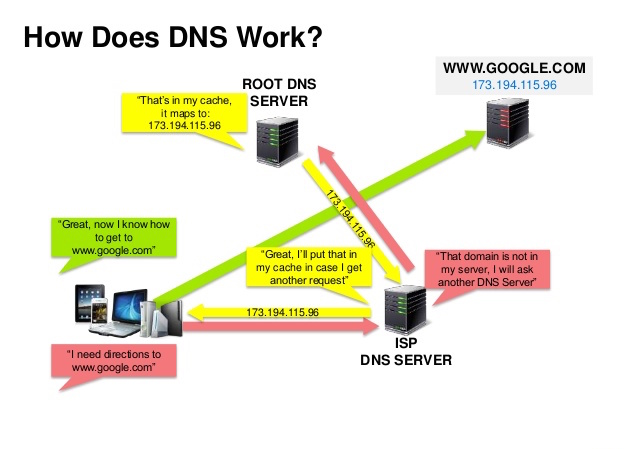

# Domain Name System

A Domain Name System (DNS) translates a domain name such as www.example.com to an IP address.

DNS is hierarchical, with a few authoritative servers at the top level. Your router or ISP provides information about which DNS server(s) to contact when doing a lookup. Lower level DNS servers cache mappings, which could become stale due to DNS propagation delays. DNS results can also be cached by your browser or OS for a certain period of time, determined by the time to live (TTL).

    NS record (name server) - Specifies the DNS servers for your domain/subdomain.
    MX record (mail exchange) - Specifies the mail servers for accepting messages.
    A record (address) - Points a name to an IP address.
    CNAME (canonical) - Points a name to another name or CNAME (example.com to www.example.com) or to an A record.

Services such as CloudFlare and Route53 provide managed DNS services. Some DNS services can route traffic through various methods:

    Weighted Round Robin
        Prevent traffic from going to servers under maintenance
        Balance between varying cluster sizes
        A/B testing
    Latency Based
    Geolocation Based

Example:

subdomain.domain.topleveldomain
www.google.com

Cons: 

Accessing a DNS server introduces a slight delay, although mitigated by caching described above.

DNS server management could be complex and is generally managed by governments, ISPs, and large companies.

DNS services have recently come under DDoS attack, preventing users from accessing websites such as Twitter without knowing Twitter's IP address(es).

#### References
https://learn.microsoft.com/en-us/previous-versions/windows/it-pro/windows-server-2008-R2-and-2008/dd197427(v=ws.10)?redirectedfrom=MSDN