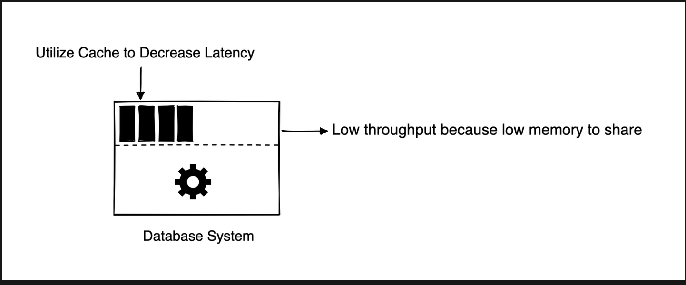

# Latency VS Throughput

Latency refers to the amount of time it takes for a system to respond to a request. Measured in milliseconds or microseconds
Throughput refers to the number of requests that a system can handle at the same time. Measured in requests per second, transactions per second, or bits per second.

*Aim for maximal throughput with acceptable latency.*

Increasing throughput often requires sacrificing some of the time it takes for the system to respond to each individual request. 

A database system that prioritizes low latency may use more memory to cache frequently accessed data, which allows for faster retrieval of data but may decrease the overall throughput as it limits the amount of available memory for handling other requests.

Analogy: the washer can wash a load in 30 minutes and a dryer that can dry in 60 minutes
N loads of laundry would take N*(90mins) to complete

### References
https://cs.fyi/guide/latency-vs-throughput